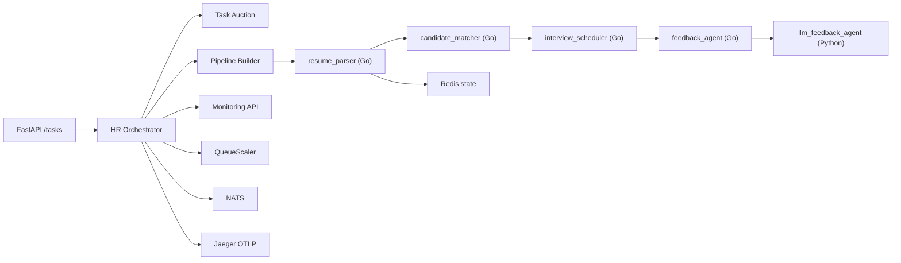

# Архитектура Lab 13

## Предметная область

Вариант 8: автоматизация HR.

Система реализует повышенный уровень сложности поверх варианта 8 и состоит из пяти агентов:

- `resume_parser` на Go: разбирает резюме, нормализует данные кандидата и сохраняет счётчики состояния.
- `candidate_matcher` на Go: вычисляет score соответствия вакансии и кандидата.
- `interview_scheduler` на Go: планирует интервью для кандидатов со статусом `invite`.
- `feedback_agent` на Go: формирует кадровое уведомление.
- `llm_feedback_agent` на Python: генерирует итоговую интеллектуальную сводку для HR.

## Покрытие повышенной сложности

1. Полная система из 3–5 агентов реализована.
2. Pipeline реализован как последовательность `resume_parser -> candidate_matcher -> interview_scheduler -> feedback_agent -> llm_feedback_agent`.
3. Точки интеграции под Jaeger и OTLP описаны в `docker-compose.yml`.
4. Stateful-агент реализован через `ResumeStats` и абстракцию `StateStore`.
5. Динамическое масштабирование реализовано сервисом `QueueScaler`.
6. Аукционное распределение реализовано через `TaskAuction`.
7. LLM-агент реализован в `src/orchestrator/services/llm_agent.py`.
8. Веб-интерфейс/панель реализованы как API-эндпоинты FastAPI для запуска задач и мониторинга.

## Взаимодействие компонентов

